# AIRAVATA DEA — Software Usage Steps

> **Guide version:** Current multi-file workflow  
> **Screenshot note:** The screenshots in this guide follow the supplied step-by-step sequence. They are stored in `screenshots/usage-step-by-step/`.

## 1. Open AIRAVATA DEA

1. Open AIRAVATA DEA in the browser or desktop application.
2. The home page opens on the fixed-width data workflow.
3. The workflow is organised into:
   - **Step 1 — Layout files**
   - **Step 2 — Data files (.TXT)**
   - **Process & download**
4. The top navigation also provides **Risk Assessment**, **Original File**, **Anonymized File**, and **Comparison** views.

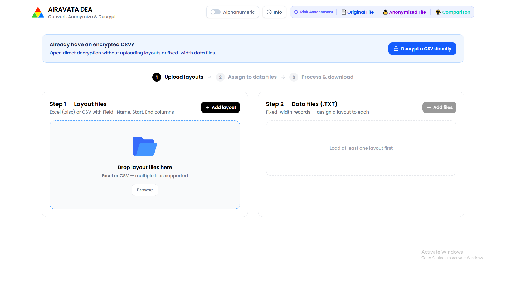
**Caption:** AIRAVATA DEA home page with the three-stage fixed-width processing workflow.

---

## 2. Select the layout workbook

1. In **Step 1 — Layout files**, click **Add layout** or **Browse**.
2. Select the Excel layout workbook.
3. The layout workbook should contain field names and fixed-width boundaries such as:
   - `Field_Name`
   - `Start`
   - `End`
4. Keep the layout workbook available while selecting the tables that describe the TXT files.

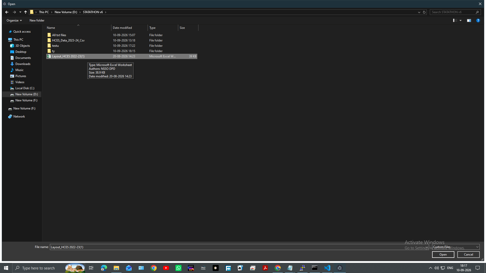
**Caption:** Windows file selection dialog used to choose the layout workbook.

---

## 3. Select the tables to import

1. AIRAVATA DEA detects the sheets and tables in the workbook.
2. Review the table names and the file name associated with each table.
3. Keep the tables required for the TXT files selected.
4. Use **Select all** or **Deselect all** when appropriate.
5. Click **Use selected tables**.

Each selected table becomes a layout entry that can be assigned to a data file.

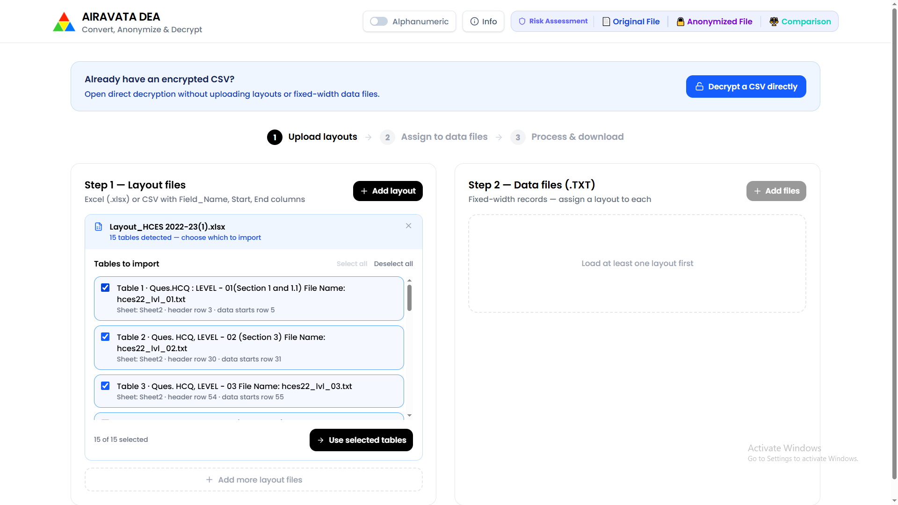
**Caption:** Detected workbook tables ready for selection before import.

---

## 4. Confirm the imported layouts

1. Review the imported layout cards in **Step 1 — Layout files**.
2. Check the displayed field names, full names, start positions, end positions, and lengths.
3. Use **Add range** when another row range from the same workbook is required.
4. Confirm that the required layout entries are ready before uploading the TXT files.

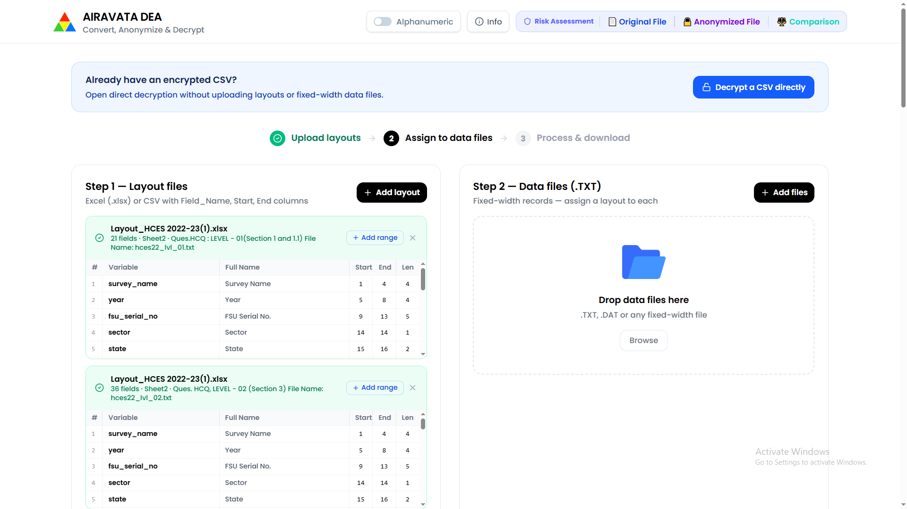
**Caption:** Imported layout entries with fixed-width field boundaries displayed for review.

---

## 5. Select multiple fixed-width TXT files

1. In **Step 2 — Data files (.TXT)**, click **Add files** or **Browse**.
2. Select all fixed-width files that should be processed together.
3. Supported file extensions include `.TXT`, `.DAT`, `.FWF`, and `.DATA`.
4. Multiple files can be selected in one operation.

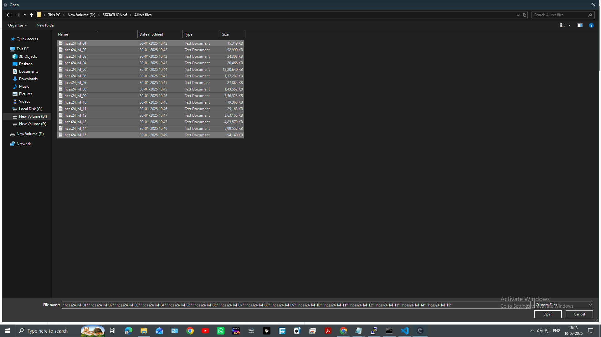
**Caption:** Windows file selection dialog showing multiple fixed-width TXT files selected together.

---

## 6. Assign a layout to each TXT file

1. Review the uploaded TXT files in the Step 2 panel.
2. Use the layout selector beside each file.
3. Assign the layout that matches the file's record structure.
4. Review each displayed record count.
5. If all files use the same layout, assign that layout to every file.
6. The **Process all files** control becomes available after the files are assigned.

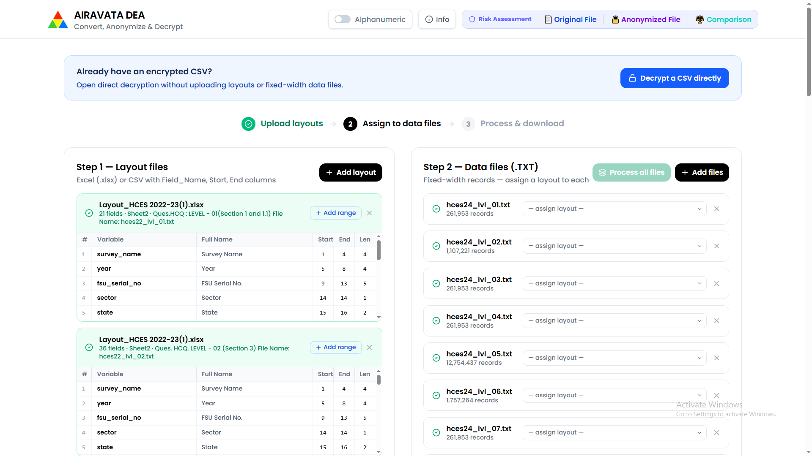
**Caption:** Multiple TXT files listed in Step 2 with the Process all files control available.

---

## 7. Process all uploaded TXT files

1. Confirm that every TXT file has a layout assigned.
2. Click **Process all files** to activate the complete TXT set together.
3. Use an individual **Process** button only when a single file needs to be activated separately.
4. Wait for the data files to become active.
5. Confirm that the active files show their assigned layout and record count.

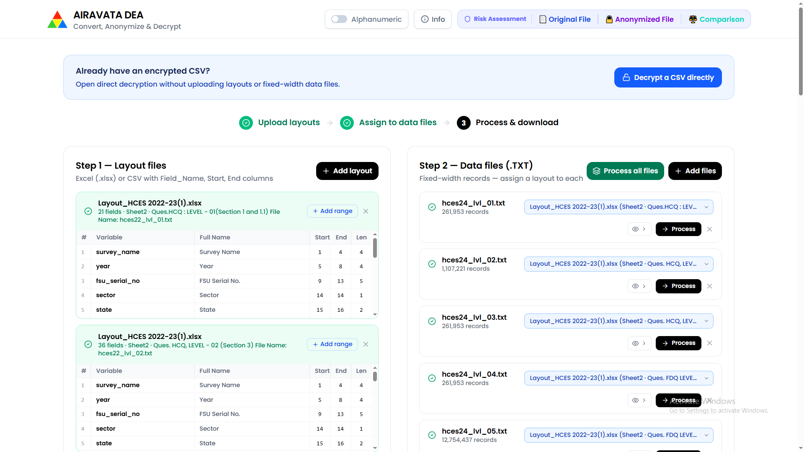
**Caption:** Step 2 showing assigned layouts and individual process controls for the uploaded TXT files.

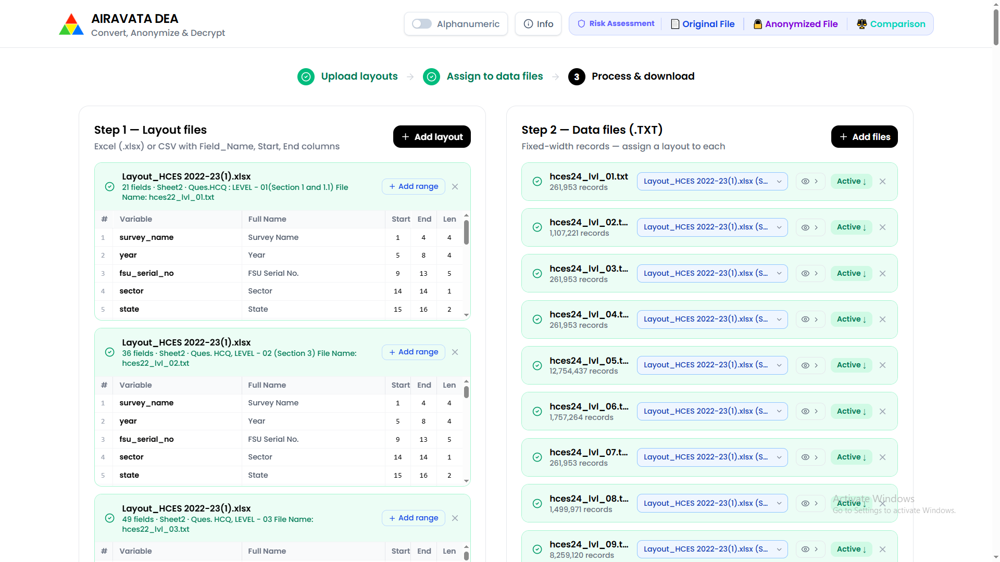
**Caption:** Multiple TXT files activated and ready for anonymisation.

---

## 8. Review the encryption settings

1. Scroll to the encryption and anonymisation section.
2. Review the **4-round encryption chain**.
3. Confirm the four seed values or select the key method required by your project.
4. Keep a secure record of the key settings used for encryption.
5. Use the same key settings when decrypting later.

The current workflow supports shared settings for all active files. It also supports deterministic processing, alphanumeric output, and strong whole-value diffusion for new files.

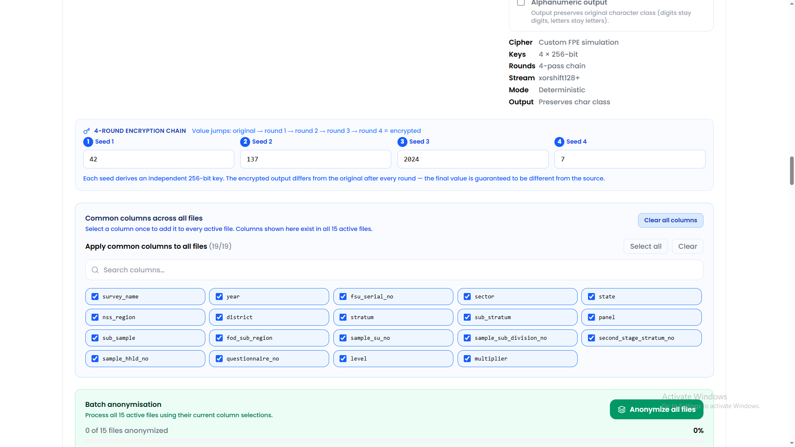
**Caption:** Shared encryption settings and the common-column selector before batch anonymisation.

---

## 9. Select common columns for every active file

Use the common-column selector when the same field exists in every active file.

1. In **Common columns across all files**, review the column list.
2. Select a column once to select it in every active file.
3. Use **Select all** to select all common columns.
4. Use **Clear** to clear only the common-column selection.
5. Use **Clear all columns** to clear selections from every active file, including columns unique to one file.
6. For columns that exist only in selected files, use the individual file section after processing.

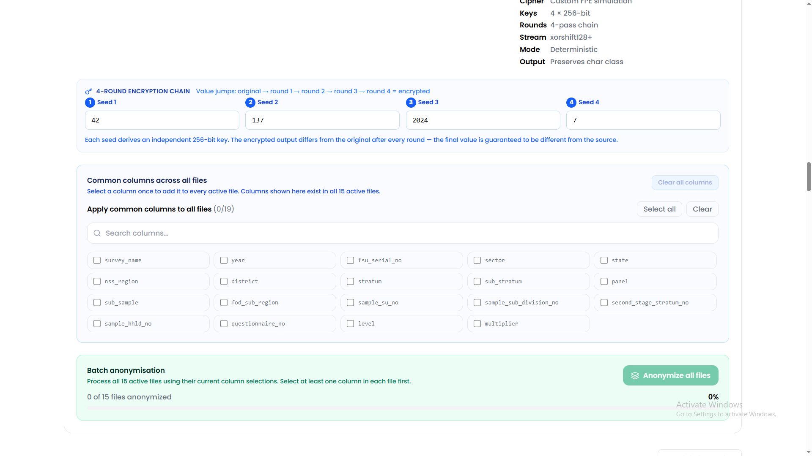
**Caption:** Common-column panel with no common columns selected and the Clear all columns control visible.

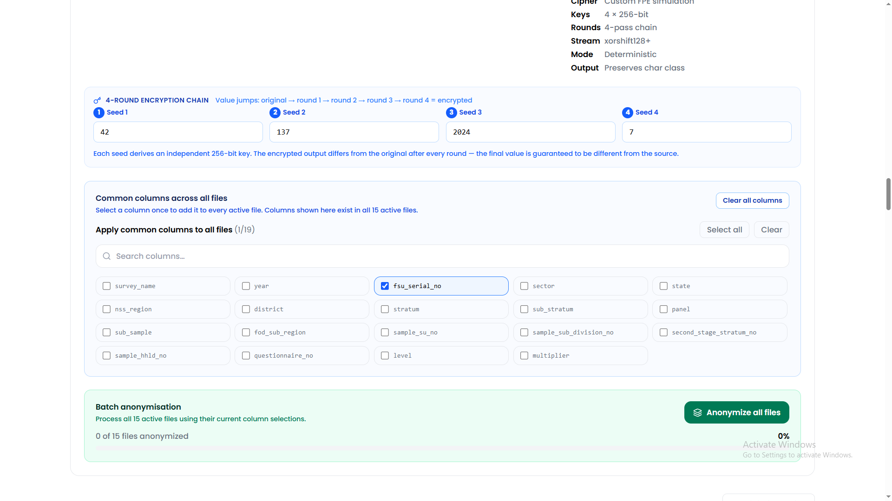
**Caption:** A common identifier column selected once for all active files.

---

## 10. Choose the output folder

1. Click **Choose output folder** in the encryption section.
2. Select the folder where all anonymised CSV files must be saved.
3. Grant read/write permission if the browser requests it.
4. Re-select the folder if a previous browser session had a permission error.
5. Keep the output folder separate from the original input folder.

For a batch operation, the selected folder is used for both small and large files. Large files are streamed to the folder, while smaller files are also written there instead of being left only as browser downloads.

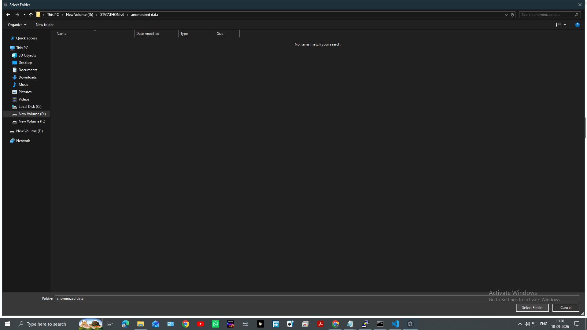
**Caption:** Output-folder selection dialog showing the folder intended for anonymised CSV files.

---

## 11. Select the columns to anonymise

1. Review the common-column selection.
2. Select at least one column in each active file.
3. Use each file's individual **Columns to encrypt** selector for file-specific columns.
4. Do not select columns that must remain unchanged.
5. Use **Clear all columns** if you want to start the selection again.

The selected fields retain their field length and character class while their values are transformed.

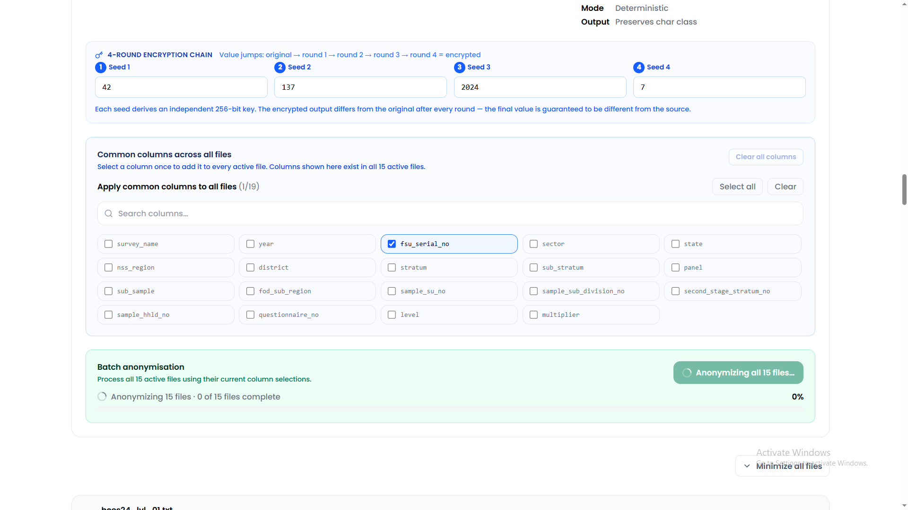
**Caption:** A selected common column and the batch anonymisation panel before processing.

---

## 12. Anonymise all files together

1. Click **Anonymize all files**.
2. All active files start anonymisation together rather than waiting for one file to finish before starting the next.
3. The overall progress bar combines the progress of every active file.
4. While processing, the panel shows the number of active files and the number completed.
5. Do not close the application or change the output folder while processing.

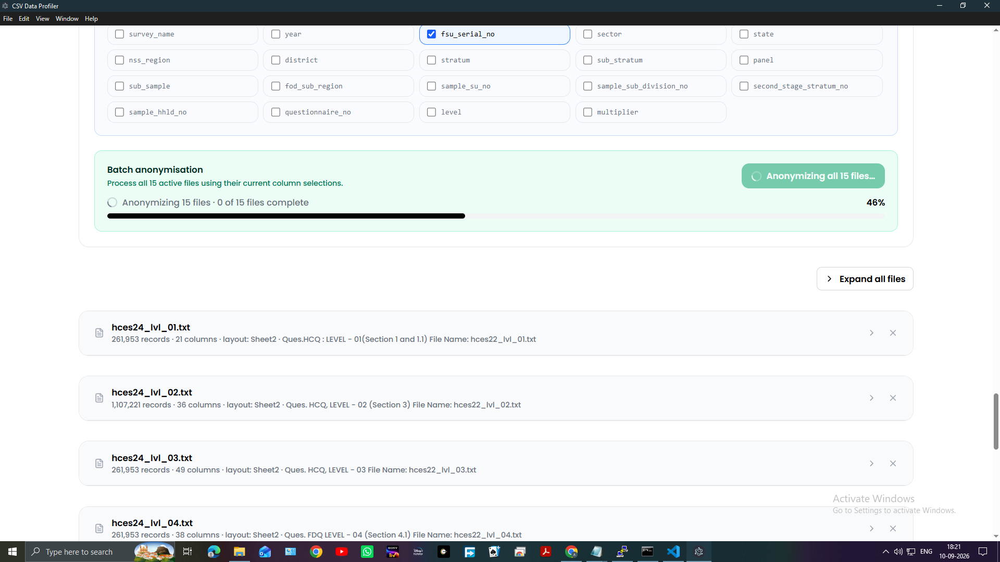
**Caption:** Batch anonymisation running across all active files with the overall progress bar and file-section collapse control.

---

## 13. Minimize or expand file sections

1. Use the arrow on an individual file card to minimize or expand that section.
2. Use **Minimize all files** to collapse every active file section.
3. When all sections are collapsed, the control changes to **Expand all files**.
4. Collapsing a section does not stop processing or remove its column selections.

The overall progress bar remains visible even when the individual file sections are minimized.

---

## 14. Confirm that the batch is complete

1. Wait until the overall progress reaches **100%**.
2. Confirm that the status reads **All files anonymized**.
3. Check that each completed file shows **Done**.
4. Expand any file section if its preview or output controls need to be reviewed.

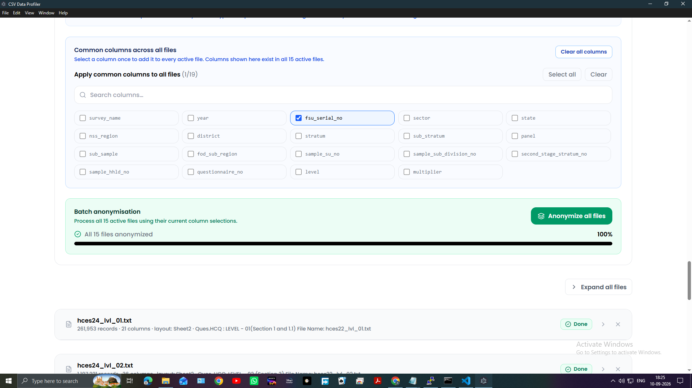
**Caption:** Completed batch showing 100% progress and all files anonymized.

---

## 15. Verify the saved anonymised CSV files

1. Open the output folder selected before anonymisation.
2. Confirm that an anonymised CSV exists for every active TXT file.
3. The output names use the source file name with an anonymised CSV suffix.
4. Check the file sizes and modified times.
5. Keep the original TXT files, anonymised CSV files, and encryption key in separate controlled locations.

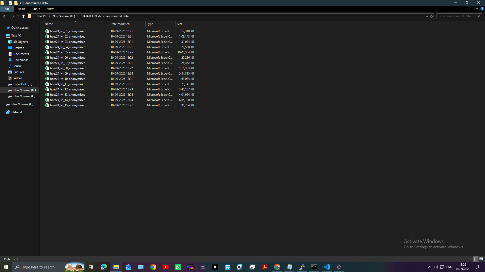
**Caption:** Output folder showing the generated anonymised CSV files for the complete batch.

---

## 16. Decrypt an anonymised CSV directly

Use direct decryption when an AIRAVATA DEA anonymised CSV is already available and the original fixed-width layout is not needed.

1. Return to the home page.
2. Click **Decrypt a CSV directly**.
3. Upload the anonymised CSV.
4. Enter the same key settings used for encryption.
5. Select the columns to decrypt.
6. Click the decryption action.
7. Review the decrypted preview.
8. Save or download the decrypted CSV.

If the file uses a legacy compact format, disable strong whole-value diffusion when required by the file's compatibility settings.

---

## 17. Assess re-identification risk

1. Open **Risk Assessment** from the top navigation.
2. Select **Original File** or **Anonymized File**.
3. Upload the corresponding CSV.
4. Select quasi-identifiers.
5. Optionally select sensitive attributes.
6. Set the k, l, t, and sample parameters.
7. Run the attack analysis.
8. Review unique records, equivalence classes, minimum k, risk percentage, and the protection status.
9. Repeat the assessment for the other file.
10. Open **Comparison** to compare original and anonymised risk results.

Risk Assessment analyses privacy risk; it does not anonymise or decrypt the file.

---

## 18. Key and file-handling rules

1. Save the encryption key securely immediately after anonymisation.
2. Use the same key settings, selected column names, and compatibility options during decryption.
3. Keep deterministic mode unchanged between encryption and decryption.
4. Keep the alphanumeric setting unchanged between encryption and decryption.
5. Keep strong whole-value diffusion enabled for new files.
6. Disable strong whole-value diffusion only for compatible legacy files.
7. Do not modify the encrypted CSV contents before decryption.
8. Verify the output with a preview or comparison before sharing it.
9. Keep original and anonymised data in separate locations.
10. For batch work, verify that every expected CSV was written to the selected output folder.

---

## 19. Complete current workflow

1. Open AIRAVATA DEA.
2. Upload the layout workbook.
3. Select and confirm the required workbook tables.
4. Upload all fixed-width TXT files.
5. Assign a layout to every TXT file.
6. Process all files.
7. Choose the output folder and grant write permission.
8. Select common columns once for all files.
9. Select any file-specific columns.
10. Click **Anonymize all files**.
11. Monitor the overall progress bar.
12. Minimize sections if needed while processing.
13. Confirm 100% completion and the **Done** state.
14. Verify every anonymised CSV in the selected output folder.
15. Store the key securely.
16. Run Risk Assessment on the original and anonymised files when required.